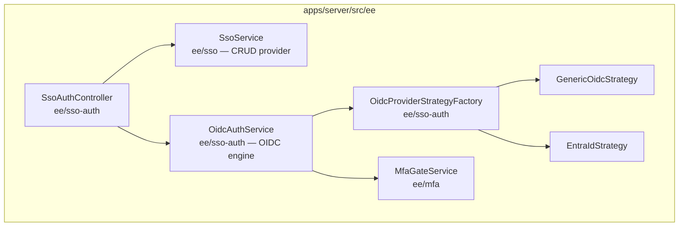

# Thiết kế: SSO OIDC / Microsoft Entra ID (EE)

## 1. Tổng quan

Entra ID được triển khai như một "flavor" của OIDC generic, không phải module/controller riêng — cùng service, cùng controller, cùng route, khác nhau qua `OidcProviderStrategy` chọn bởi factory. Toàn bộ thay đổi nằm trong `apps/server/src/ee/` và `apps/client/src/ee/`; core chỉ nhận 1 thay đổi cơ học (đổi tên field metadata audit).

Kiến trúc tham chiếu (đã có sẵn trong repo, không đổi):



## 2. Mô hình dữ liệu

### 2.1 Migration: `auth_providers`

Thêm cột `oidc_tenant_id varchar` (nullable ở DB, bắt buộc ở tầng ứng dụng khi provider là Entra ID).

```
pnpm --filter ./apps/server run migration:create add-oidc-tenant-id
pnpm --filter ./apps/server run migration:codegen
```

### 2.2 Migration: `audit`

Thêm cột `user_agent varchar` (nullable) — gộp chung với migration 2.1 thành một lần thay đổi schema.

## 3. Server

### 3.1 `OidcProviderStrategy` + `OidcProviderStrategyFactory`

File mới trong `apps/server/src/ee/sso-auth/`:

- `oidc-provider-strategy.interface.ts`
- `strategies/generic-oidc.strategy.ts`
- `strategies/entra-id.strategy.ts`
- `oidc-provider-strategy.factory.ts`

```ts
// oidc-provider-strategy.interface.ts
export interface OidcProviderStrategy {
  readonly flavor: 'generic' | 'entra-id';
  getCallbackPath(): string;
  getExtraScopes(): string[];
  normalizeIssuer(issuerUrl: URL): URL;
  fetchAvatar(
    tokens: { access_token?: string },
  ): Promise<{ buffer: Buffer; mimeType: string } | undefined>;
}
```

```ts
// strategies/generic-oidc.strategy.ts
@Injectable()
export class GenericOidcStrategy implements OidcProviderStrategy {
  readonly flavor = 'generic' as const;

  getCallbackPath(): string {
    return '/api/sso/oidc/callback';
  }

  getExtraScopes(): string[] {
    return [];
  }

  normalizeIssuer(issuerUrl: URL): URL {
    return issuerUrl;
  }

  async fetchAvatar() {
    return undefined;
  }
}
```

```ts
// strategies/entra-id.strategy.ts
@Injectable()
export class EntraIdStrategy implements OidcProviderStrategy {
  private readonly logger = new Logger(EntraIdStrategy.name);
  readonly flavor = 'entra-id' as const;

  getCallbackPath(): string {
    return '/api/sso/EntraId/callback';
  }

  getExtraScopes(): string[] {
    return ['https://graph.microsoft.com/User.Read'];
  }

  normalizeIssuer(issuerUrl: URL): URL {
    const match = issuerUrl.pathname.match(
      /^\/([^/]+)\/federationmetadata\/.*federationmetadata\.xml$/i,
    );
    if (match) {
      return new URL(`https://${issuerUrl.hostname}/${match[1]}/v2.0`);
    }
    return issuerUrl;
  }

  async fetchAvatar(tokens: { access_token?: string }) {
    if (!tokens.access_token) return undefined;
    try {
      const res = await fetch('https://graph.microsoft.com/v1.0/me/photo/$value', {
        headers: { Authorization: `Bearer ${tokens.access_token}` },
      });
      if (res.status === 404) return undefined;
      if (!res.ok || !res.headers.get('content-type')?.startsWith('image/')) {
        return undefined;
      }
      return {
        buffer: Buffer.from(await res.arrayBuffer()),
        mimeType: res.headers.get('content-type')!,
      };
    } catch (error) {
      this.logger.warn(`Graph avatar fetch failed: ${error}`);
      return undefined;
    }
  }
}
```

```ts
// oidc-provider-strategy.factory.ts
@Injectable()
export class OidcProviderStrategyFactory {
  constructor(
    private readonly genericStrategy: GenericOidcStrategy,
    private readonly entraIdStrategy: EntraIdStrategy,
  ) {}

  create(provider: { oidcIssuer: string; settings?: any }): OidcProviderStrategy {
    if (provider.settings?.oidc?.provider === 'azuread') {
      return this.entraIdStrategy;
    }
    return this.genericStrategy;
  }
}
```

Đăng ký `GenericOidcStrategy`, `EntraIdStrategy`, `OidcProviderStrategyFactory` vào `providers` của `SsoAuthModule` hiện có.

### 3.2 `OidcAuthService`

- Inject `OidcProviderStrategyFactory`.
- `normalizeIssuerUrl`: sau khi bỏ hậu tố `.well-known/openid-configuration`, gọi `strategy.normalizeIssuer(parsed)`.
- `buildAuthorizationUrl`: `scope = ['openid', 'profile', 'email', ...strategy.getExtraScopes()].join(' ')`.
- `handleCallback`: sau `authorizationCodeGrant`, gọi `strategy.fetchAvatar(tokens)`; truyền kết quả vào `resolveUser` để gọi `AttachmentService.uploadUserAvatarFromBuffer` khi có buffer.
- Ghép display name: `claims.name ?? [claims.given_name, claims.family_name].filter(Boolean).join(' ') ?? email` — đặt trực tiếp trong `OidcAuthService`, không thuộc strategy.
- Xoá `isAzureProvider()` khỏi service.

### 3.3 `SsoService` (`apps/server/src/ee/sso/sso.service.ts`)

**Mã hoá + mask `clientSecret`:**
- `encryptSecret(plain: string): string` / `decryptSecret(value: string): string` — AES-256-GCM, khoá `sha256(environmentService.getAppSecret())`, giá trị lưu `enc:<base64(iv|tag|ciphertext)>`. Giá trị không có prefix `enc:` được coi là plaintext (tương thích ngược), mã hoá lại ở lần `update` kế tiếp.
- `create()`/`update()`: gọi `encryptSecret` trước khi lưu `oidcClientSecret`.
- `mapProvider()`: trả `oidcClientSecret ? '********' : null`, không bao giờ trả secret thật.
- `OidcAuthService` giải mã bằng `decryptSecret` khi cần secret thật cho `discovery()`/token exchange.

**`tenantId` cho Entra ID:**
- `create()`/`update()`: khi `settings.oidc.provider === 'azuread'`, `tenantId` bắt buộc (`BadRequestException` nếu thiếu); `oidcIssuer` được dựng tự động: `https://login.microsoftonline.com/<tenantId>/v2.0`, ghi đè issuer input nếu có.
- `mapProvider()` trả thêm `oidcTenantId`.
- Đổi `settings.oidc.provider` giữa `'generic'` ↔ `'azuread'` sau khi tạo vẫn hợp lệ, validate lại field bắt buộc tương ứng.

### 3.4 Route OIDC (`apps/server/src/ee/sso-auth/sso-auth.controller.ts`)

Callback URL khác nhau theo flavor — mỗi `OidcProviderStrategy` khai báo path riêng qua `getCallbackPath()`:

| Flavor | Callback path | Route | Ghi chú |
|---|---|---|---|
| Generic OIDC | `/api/sso/oidc/callback` | `GET /sso/oidc/callback` | Không có `:providerId` |
| Microsoft Entra ID | `/api/sso/EntraId/callback` | `GET /sso/EntraId/callback` | Không có `:providerId` |
| (cũ) | — | `GET /sso/oidc/:providerId/callback` | Xoá |
| Login (cả 2 flavor) | — | `GET /sso/oidc/:providerId/login` | Không đổi |

`OidcAuthService.buildCallbackUrl(provider)` gọi `strategyFactory.create(provider).getCallbackPath()` để lấy đúng path theo flavor, dùng ở cả `buildAuthorizationUrl` (redirect_uri gửi cho IdP) và khi build lại `currentUrl` trong `handleCallback` (token exchange) — 2 route callback trên server đều gọi chung `finishOidcLogin`, vì provider luôn được resolve từ `providerId` trong signed state cookie `oidc_state`, không phụ thuộc route nào được gọi.

Client `apps/client/src/ee/security/sso.utils.ts`: `buildCallbackUrl` nhận thêm `isAzureAd?: boolean` — `type === 'oidc' && isAzureAd` trả `/api/sso/EntraId/callback`, ngược lại `type === 'oidc'` (generic) hoặc `GOOGLE` trả `/api/sso/<type>/callback`. `sso-oidc-form.tsx` truyền `isAzureAd` theo template đang chọn nên URL hiển thị/copy đổi động ngay khi admin đổi template.

Trước khi deploy: cập nhật [SETUP.md](SETUP.md) với cả 2 Redirect URI mới (`/api/sso/oidc/callback` cho Generic OIDC, `/api/sso/EntraId/callback` cho Entra ID), thông báo admin cập nhật Azure App Registration trước thời điểm deploy.

### 3.5 `AttachmentService.uploadUserAvatarFromBuffer`

Thêm vào `apps/server/src/core/attachment/services/attachment.service.ts`, và thêm `AttachmentService` vào `exports` của `AttachmentModule`.

```ts
async uploadUserAvatarFromBuffer(opts: {
  buffer: Buffer;
  mimeType: string;
  userId: string;
  workspaceId: string;
}) {
  const extensionByMimeType: Record<string, string> = {
    'image/jpeg': '.jpg',
    'image/jpg': '.jpg',
    'image/png': '.png',
  };
  const normalizedMimeType = opts.mimeType.toLowerCase().split(';')[0].trim();
  const fileExtension = extensionByMimeType[normalizedMimeType];
  if (!fileExtension || !validImageExtensions.includes(fileExtension)) {
    throw new BadRequestException('Unsupported avatar image type');
  }

  const preparedFile: PreparedFile = {
    buffer: opts.buffer,
    fileName: uuid4() + fileExtension,
    fileExtension,
    fileSize: opts.buffer.byteLength,
    mimeType: normalizedMimeType,
  };

  const filePath = `${getAttachmentFolderPath(AttachmentType.Avatar, opts.workspaceId)}/${preparedFile.fileName}`;
  await this.uploadToDrive(filePath, preparedFile.buffer);

  let attachment: Attachment = null;
  let oldFileName: string = null;

  try {
    await executeTx(this.db, async (trx) => {
      attachment = await this.saveAttachment({
        preparedFile,
        filePath,
        type: AttachmentType.Avatar,
        userId: opts.userId,
        workspaceId: opts.workspaceId,
        trx,
      });

      const user = await this.userRepo.findById(opts.userId, opts.workspaceId, { trx });
      oldFileName = user.avatarUrl;

      await this.userRepo.updateUser(
        { avatarUrl: preparedFile.fileName },
        opts.userId,
        opts.workspaceId,
        trx,
      );
    });
  } catch (err) {
    await this.deleteRedundantFile(filePath);
    this.logger.error('uploadUserAvatarFromBuffer transaction failed', err);
    throw new BadRequestException('Failed to upload image');
  }

  if (oldFileName && !oldFileName.toLowerCase().startsWith('http')) {
    const oldFilePath = `${getAttachmentFolderPath(AttachmentType.Avatar, opts.workspaceId)}/${oldFileName}`;
    await this.deleteRedundantFile(oldFilePath);
  }

  return attachment;
}
```

Gọi từ `OidcAuthService.resolveUser`, best-effort (bọc try/catch riêng, lỗi upload avatar không chặn đăng nhập).

### 3.6 MFA — `MfaGateService`

File mới `apps/server/src/ee/mfa/services/mfa-gate.service.ts`, export từ `MfaModule`.

```ts
export interface LoginContext {
  method: 'local' | 'oidc' | 'ldap' | 'saml';
  providerId?: string;
  providerName?: string;
}

@Injectable()
export class MfaGateService {
  constructor(
    private readonly userMfaRepo: UserMfaRepo,
    private readonly tokenService: TokenService,
    private readonly sessionService: SessionService,
    @Inject(AUDIT_SERVICE) private readonly auditService: IAuditService,
  ) {}

  async checkAndChallenge(
    user: User,
    workspace: Workspace,
    res: FastifyReply,
    loginContext: LoginContext,
  ): Promise<{ requiresMfa: true } | { requiresMfa: false; authToken: string }> {
    const mfa = await this.userMfaRepo.findByUserId(user.id);
    const userHasMfa = mfa?.isEnabled === true;
    const isMfaEnforced = workspace.enforceMfa === true;

    if (userHasMfa || isMfaEnforced) {
      const mfaToken = await this.tokenService.generateMfaToken(user, workspace.id, loginContext);
      res.setCookie('mfaToken', mfaToken, { httpOnly: true, sameSite: 'lax', path: '/', maxAge: 300 });
      return { requiresMfa: true };
    }

    this.auditService.setActorId(user.id);
    this.auditService.setActorType('user');
    this.auditService.log({
      event: AuditEvent.USER_LOGIN,
      resourceType: AuditResource.USER,
      resourceId: user.id,
      metadata: {
        method: loginContext.method,
        providerId: loginContext.providerId,
        providerName: loginContext.providerName,
      },
    });

    const authToken = await this.sessionService.createSessionAndToken(user);
    return { requiresMfa: false, authToken };
  }
}
```

**Wiring theo luồng:**

| Luồng | File | Thay đổi |
|---|---|---|
| Local | `apps/server/src/ee/mfa/services/mfa.service.ts` (`checkMfaRequirements`) | Nhánh không cần MFA: thêm `setActorId`/`setActorType` + `auditService.log(metadata: { method: 'local' })` trước `createSessionAndToken`. Nhánh cần MFA: `generateMfaToken(user, workspace.id, { method: 'local' })`. Cơ chế gọi từ `auth.controller.ts` (require động + `ModuleRef`) giữ nguyên, không đổi |
| OIDC | `apps/server/src/ee/sso-auth/oidc-auth.service.ts` | Inject `MfaGateService` (DI thường); sau khi resolve user, gọi `checkAndChallenge(user, workspace, res, { method: 'oidc', providerId, providerName })` trước khi tạo session |
| LDAP | `apps/server/src/ee/sso-auth/sso-auth.service.ts` (`ldapLogin`) | Inject `MfaGateService`; gọi `checkAndChallenge(user, workspace, res, { method: 'ldap', providerId, providerName })` sau khi bind thành công |
| MFA verify | `apps/server/src/ee/mfa/services/mfa.service.ts` (`verifyAndLogin`) | Đọc `method`/`providerId`/`providerName` từ `JwtMfaTokenPayload`; `setActorId`/`setActorType` + log **một** `USER_LOGIN` với `metadata: { method, providerId?, providerName?, mfaUsed: true }` |

`JwtMfaTokenPayload` ([jwt-payload.ts](../../apps/server/src/core/auth/dto/jwt-payload.ts)) mở rộng thêm `method`, `providerId?`, `providerName?`. `TokenService.generateMfaToken(user, workspaceId, loginContext: LoginContext)` nhận thêm tham số thứ 3.

`checkMfaRequirements()` không hợp nhất vào `MfaGateService` — nó còn xác thực password, khác trách nhiệm với OIDC/LDAP (đã tự xác thực xong trước khi gọi gate).

### 3.7 Audit log

**Event mới** (`apps/server/src/common/events/audit-events.ts`):

```ts
USER_LOGIN_FAILED: 'user.login_failed',
```

**Schema `metadata` cho `USER_LOGIN`:**

```ts
interface LoginAuditMetadata {
  method: 'local' | 'oidc' | 'ldap' | 'saml';
  providerId?: string;
  providerName?: string;
  mfaUsed?: boolean;
}
```

**Schema `metadata` cho `USER_LOGIN_FAILED`:**

```ts
interface LoginFailedAuditMetadata {
  method: 'local' | 'oidc' | 'ldap' | 'saml';
  providerId?: string;
  providerName?: string;
  failureReason: string;
  attemptedEmail?: string; // khi không resolve được user
}
```

**Vị trí ghi log theo phương thức:**

| Phương thức | Thành công | Thất bại (`failureReason`) |
|---|---|---|
| Local | `checkMfaRequirements()` nhánh không cần MFA (mục 3.6) | `auth.service.ts` — `!user \|\| isUserDisabled(user)` → `user_not_found`/`account_disabled`; `!isPasswordMatch` → `invalid_password` |
| OIDC | `MfaGateService.checkAndChallenge` (qua `oidc-auth.service.ts`) | `oidc-auth.service.ts` `handleCallback` catch/throw → `invalid_state`, `missing_claim`, `signup_disabled`, `token_exchange_failed` |
| LDAP | `MfaGateService.checkAndChallenge` (qua `sso-auth.service.ts`) | `ldapLogin` bind/user lookup thất bại → `bind_failed`, `user_not_found` |
| MFA | `verifyAndLogin()`, `mfaUsed: true` | `verifyAndLogin()` `!valid` → `invalid_mfa_code` |

**Quy tắc chung:**
- `setActorId(user.id)` + `setActorType('user')` bắt buộc trước mỗi `auditService.log` liên quan tới 1 user cụ thể.
- Khi thất bại và không resolve được user (sai mật khẩu, email không tồn tại): không set `actorId`, dùng `metadata.attemptedEmail` để nhận diện.
- Không log password hay secret vào `metadata`.
- `USER_LOGIN_FAILED` không đưa vào `EXCLUDED_AUDIT_EVENTS`.
- IP: không cần thay đổi — `trustProxy: true` đã bật ở `apps/server/src/main.ts`, `AuditContextMiddleware` đã dùng `req.ip` (tự resolve đúng qua `X-Forwarded-For` khi có reverse proxy/F5). Tuỳ chọn: thêm `metadata.forwardedChain = req.ips` cho điều tra sâu.
- User agent: `AuditLogService.insertLog` ghi thêm `userAgent: context.userAgent ?? null` vào cột mới (mục 2.2).
- Thời gian: dùng `created_at` có sẵn, không cần field riêng.

## 4. Client

### 4.1 `sso-oidc-form.tsx`

Thêm control chọn template ở đầu form (Mantine `SegmentedControl`): **"Generic OIDC"** (mặc định) / **"Microsoft Entra ID"**.

| Template | Field hiển thị | Ẩn |
|---|---|---|
| Generic OIDC | Issuer URL (nhập tay), Client ID, Client Secret | Tenant ID |
| Microsoft Entra ID | Tenant ID (bắt buộc), Client ID, Client Secret, Issuer URL (read-only, tự dựng) | — |

- Icon đổi theo template: `OpenIdIcon` ↔ `EntraIdIcon` ([entra-id-icon.tsx](../../apps/client/src/components/icons/entra-id-icon.tsx)).
- `ssoSchema` (Zod): discriminated union theo `template` — `oidcIssuer` bắt buộc khi `generic`, `oidcTenantId` bắt buộc khi `entra-id`.
- Giá trị `template` lưu vào `settings.oidc.provider` (`'generic'`/`'azuread'`) qua `SsoService.update()`.
- `create-sso-provider.tsx` không đổi — vẫn 1 mục "OpenID (OIDC)" trong menu tạo, dùng `OpenIdIcon`.

### 4.2 `security.types.ts`

`IAuthProvider` thêm `tenantId?: string`.

## 5. Sequence diagram

```mermaid
sequenceDiagram
    autonumber
    actor Browser
    participant Controller as SsoAuthController
    participant Service as OidcAuthService
    participant MfaGate as MfaGateService
    participant Entra as Entra ID
    participant Graph as Microsoft Graph

    Browser->>Controller: GET /sso/oidc/:id/login
    Controller->>Service: buildAuthorizationUrl(providerId)
    Service->>Entra: discovery (.well-known/openid-configuration)
    Entra-->>Service: OIDC metadata + JWKS
    Note right of Service: redirect_uri = strategy.getCallbackPath()<br/>Generic: /api/sso/oidc/callback<br/>Entra ID: /api/sso/EntraId/callback
    Service-->>Controller: authUrl + signed state
    Controller-->>Browser: 302 + Set-Cookie oidc_state (httpOnly, 10min)

    Browser->>Entra: 302 to authorize endpoint
    Note over Browser,Entra: User đăng nhập tại Entra ID
    Entra-->>Browser: 302 back to callback path?code&state

    Browser->>Controller: GET /sso/oidc/callback hoặc /sso/EntraId/callback
    Controller->>Service: handleCallback(code, state, stateCookie)
    Service->>Service: verify signed state (HMAC, TTL)
    Service->>Entra: authorizationCodeGrant
    Entra-->>Service: id_token + access_token

    opt Provider là Entra ID
        Service->>Graph: GET /me/photo/$value
        Graph-->>Service: avatar bytes hoặc 404
    end

    Service->>Service: resolveUser (JIT provisioning, transaction)
    Service->>MfaGate: checkAndChallenge(user, workspace, res, loginContext)

    alt Cần MFA
        MfaGate-->>Controller: requiresMfa: true (đã set cookie mfaToken)
        Controller-->>Browser: yêu cầu nhập mã MFA
    else Không cần MFA
        MfaGate->>MfaGate: audit log USER_LOGIN
        MfaGate-->>Controller: authToken
        Controller-->>Browser: 302 + Set-Cookie authToken; clear oidc_state
    end
```

## 6. Danh sách file thay đổi

**Server — mới:**
- `apps/server/src/ee/sso-auth/oidc-provider-strategy.interface.ts`
- `apps/server/src/ee/sso-auth/strategies/generic-oidc.strategy.ts`
- `apps/server/src/ee/sso-auth/strategies/entra-id.strategy.ts`
- `apps/server/src/ee/sso-auth/oidc-provider-strategy.factory.ts`
- `apps/server/src/ee/mfa/services/mfa-gate.service.ts`
- Migration: cột `oidc_tenant_id` (`auth_providers`), `user_agent` (`audit`)

**Server — sửa:**
- `apps/server/src/ee/sso-auth/oidc-auth.service.ts` — factory, display name, callback URL cố định
- `apps/server/src/ee/sso-auth/sso-auth.controller.ts` — route callback riêng theo flavor (`/sso/oidc/callback`, `/sso/EntraId/callback`), xoá route theo `:providerId`
- `apps/server/src/ee/sso-auth/sso-auth.module.ts` — đăng ký strategy/factory
- `apps/server/src/ee/sso-auth/sso-auth.service.ts` (`ldapLogin`) — `MfaGateService`, audit log
- `apps/server/src/ee/sso/sso.service.ts` — mã hoá/mask secret, `tenantId`
- `apps/server/src/ee/mfa/services/mfa.service.ts` — audit trong `checkMfaRequirements`/`verifyAndLogin`, `MfaGateService` export
- `apps/server/src/core/auth/dto/jwt-payload.ts` — mở rộng `JwtMfaTokenPayload`
- `apps/server/src/core/auth/services/token.service.ts` — `generateMfaToken` nhận `loginContext`
- `apps/server/src/core/auth/services/auth.service.ts` — đổi `metadata.source` → `metadata.method`
- `apps/server/src/core/attachment/services/attachment.service.ts` — `uploadUserAvatarFromBuffer`
- `apps/server/src/core/attachment/attachment.module.ts` — export `AttachmentService`
- `apps/server/src/common/events/audit-events.ts` — `USER_LOGIN_FAILED`

**Client — mới:**
- `apps/client/src/components/icons/entra-id-icon.tsx` (đã tạo)

**Client — sửa:**
- `apps/client/src/ee/security/components/sso-oidc-form.tsx` — template selector, field theo template, icon động
- `apps/client/src/ee/security/sso.utils.ts` — callback URL chung cho OIDC
- `apps/client/src/ee/security/types/security.types.ts` — `tenantId`

**Tài liệu:**
- [SETUP.md](SETUP.md) — Redirect URI mới

## 7. Phạm vi Golden Rule

- Không tạo controller/module Entra ID riêng — hành vi nằm trong `EntraIdStrategy`, chọn qua `OidcProviderStrategyFactory`, đăng ký trong `SsoAuthModule`/`MfaModule` hiện có.
- Thay đổi core chỉ gồm: 1 dòng đổi tên field metadata (`auth.service.ts`), mở rộng payload JWT MFA (`jwt-payload.ts`, `token.service.ts` — cơ học, không thêm nghiệp vụ), thêm method mới vào `attachment.service.ts` (tách biệt, không đụng logic upload hiện có).
- `auth.controller.ts` không đổi cơ chế gọi EE — giữ nguyên `require()` động bọc try/catch `MODULE_NOT_FOUND`.
