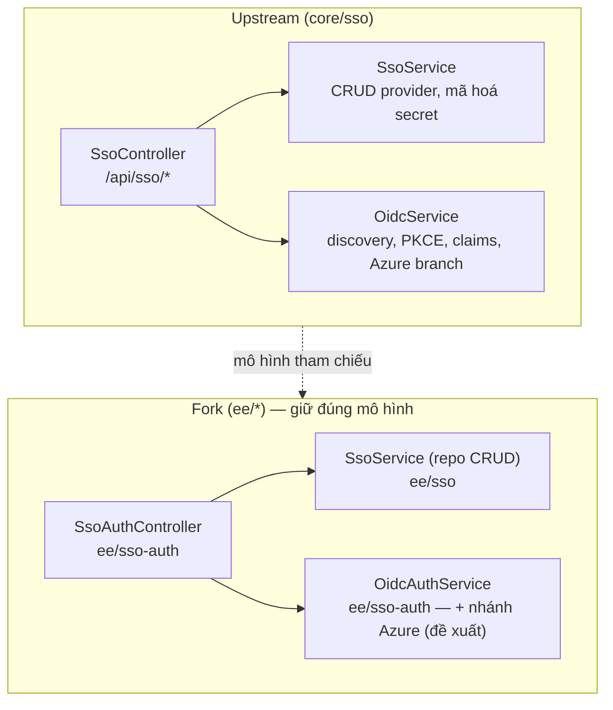

# Thiết kế: SSO OIDC / Azure AD (Entra ID) cho EE — theo logic upstream Docmost

> Tài liệu này đối chiếu cách upstream (`/Users/vunguyen/workspaces/02.ETC/docmost`) triển khai đăng nhập SSO qua OIDC/Entra ID, và định nghĩa thiết kế tương ứng cho fork này, giữ nguyên vị trí code trong `ee/` theo Golden Rule của repo. Tham khảo thêm [README.md](README.md), [ARCHITECTURE.md](ARCHITECTURE.md), [SECURITY.md](SECURITY.md) đã có trong thư mục này cho phần chi tiết đã triển khai trước đó; tài liệu này tập trung vào phần **đối chiếu & còn thiếu** so với upstream.

## 1. Kết luận từ phân tích upstream

Upstream **không có module Azure AD riêng**. Toàn bộ SSO OIDC (bao gồm Entra ID) nằm trong một cặp service dùng chung cho mọi IdP tuân thủ chuẩn OIDC:

- `apps/server/src/core/sso/services/sso.service.ts` — CRUD provider, mã hoá secret, validate issuer.
- `apps/server/src/core/sso/services/oidc.service.ts` — discovery, build authorization URL, exchange code, resolve claims.
- `apps/server/src/core/sso/sso.controller.ts` — route `/api/sso/...`.

"Azure AD" chỉ là một **cờ hành vi** (`provider.settings.oidc.provider === 'azuread'` hoặc phát hiện qua issuer host `login.microsoftonline.com`), bật thêm 3 hành vi:
1. Thêm scope `https://graph.microsoft.com/User.Read`.
2. Sau khi có access token, gọi Microsoft Graph `GET /me/photo/$value` để đồng bộ avatar.
3. Chuẩn hoá issuer dạng "federation metadata" của Azure về `https://login.microsoftonline.com/<tenant>/v2.0`.

→ **Thiết kế cho fork nên giữ đúng mô hình này**: một OIDC engine dùng chung, Azure/Entra chỉ là nhánh hành vi có điều kiện — không tách thành module/controller riêng. Đây cũng đúng với hướng đi hiện tại của repo (xem `apps/server/src/ee/sso-auth/`).



## 2. Đối chiếu hiện trạng EE (fork) với upstream

| Khía cạnh | Upstream (`core/sso`) | EE hiện tại (`ee/sso`, `ee/sso-auth`) | Đánh giá |
|---|---|---|---|
| Vị trí module | `core/sso` (module lõi, load tĩnh) | `ee/sso` (data/repo) + `ee/sso-auth` (OIDC/LDAP flow), load qua `ee.module.ts` | Đúng Golden Rule của fork — SSO nằm trong `ee/` thay vì core |
| Bảng dữ liệu | `auth_providers`, `auth_accounts`, cột `enforce_sso` trên `workspaces` | Tương đương ([auth-provider.repo.ts](../../apps/server/src/ee/sso/auth-provider.repo.ts), `auth-account.repo.ts`) | Khớp |
| Discovery | `openid-client` `discovery()` | `client.discovery()` trong [oidc-auth.service.ts:82](../../apps/server/src/ee/sso-auth/oidc-auth.service.ts) | Khớp |
| Chuẩn hoá issuer | Bỏ hậu tố `.well-known/...`, rewrite Azure federation metadata URL → issuer chuẩn, trích `tenantId` | Chỉ bỏ hậu tố `.well-known/...` ([normalizeIssuerUrl](../../apps/server/src/ee/sso-auth/oidc-auth.service.ts:59)) | **Thiếu**: chưa xử lý URL kiểu `federationmetadata/...` |
| PKCE + state + nonce | Có, đóng gói trong signed state (HMAC) qua cookie | Có, qua `encodeOidcState`/`decodeOidcState` (HMAC, [oidc-state.util.ts](../../apps/server/src/ee/sso-auth/oidc-state.util.ts)) | Khớp |
| Callback URL | Một path chung `/api/sso/oidc/callback` cho toàn workspace | Hiện tại theo từng provider `/api/sso/oidc/:providerId/callback` | **Xác nhận đổi theo upstream** — xem mục 3.4 |
| Claim → email | `email` → fallback `preferred_username` | Giống hệt ([oidc-auth.service.ts:201-203](../../apps/server/src/ee/sso-auth/oidc-auth.service.ts:201)) | Khớp |
| Claim → display name | `name` → `given_name+family_name` → từng phần | Chỉ `name` → fallback email | **Thiếu**: chưa ghép `given_name`/`family_name` |
| Scope mở rộng cho Azure | Thêm `https://graph.microsoft.com/User.Read` khi phát hiện Azure | Luôn cố định `openid profile email`, không có nhánh Azure | **Thiếu** |
| Avatar sync từ Graph | `GET /me/photo/$value` bằng access token, upload qua `attachmentService` | Chưa có (nhưng `AttachmentService.uploadUserAvatarFromBuffer` đã được export ở commit `c263790f` — hạ tầng đã sẵn sàng) | **Thiếu phần gọi Graph + wiring vào `resolveUser`** |
| Mã hoá client secret | AES-256-GCM, key = `sha256(APP_SECRET)`, prefix `enc:`, mask khi trả response | **Đã xác nhận thiếu**: lưu plaintext, `mapProvider()` trả secret thật về client, không mask | **Thiếu, ưu tiên P0 (bảo mật)** — xem mục 3.5.2 |
| Tenant ID | Trích từ issuer hoặc admin nhập kèm scope Azure | **Không tồn tại** — không có cột DB/field form | **Thiếu** — xem mục 3.5.1 |
| JIT provisioning | Link theo `auth_accounts(sub)` → fallback email → tạo mới nếu `allowSignup` | Giống hệt ([resolveUser](../../apps/server/src/ee/sso-auth/oidc-auth.service.ts:240)) | Khớp |
| Redirect sau login | Redirect cố định `/` | Hỗ trợ `?redirect=` với validate an toàn (`isSafeRedirectPath`) | **Tốt hơn upstream**, giữ nguyên |
| Group sync | Cột `group_sync`, nhưng logic đồng bộ nhóm thực tế nằm ở SCIM, không phải trong OIDC callback | Chưa xác nhận | Không cần làm trong phạm vi OIDC — để dành cho SCIM nếu áp dụng |

## 3. Thiết kế đề xuất bổ sung (giữ trong `ee/sso-auth`, không đụng core)

**Thay đổi so với bản trước:** thay vì rải các nhánh `if (isAzureProvider(...))` trực tiếp trong `OidcAuthService`, phần hành vi riêng theo "flavor" của IdP (generic OIDC vs Entra ID) được tách thành **Factory Pattern** — vẫn hoàn toàn nằm trong `apps/server/src/ee/sso-auth/`, **không tạo controller/module Azure riêng**, không thêm route mới, không đổi public API. `OidcAuthService` vẫn là service and controller duy nhất xử lý OIDC; nó chỉ gọi vào một `strategy` do factory trả về thay vì tự if/else.

### 3.0 Kiến trúc: `OidcProviderStrategy` + `OidcProviderStrategyFactory`

File mới (đều trong `apps/server/src/ee/sso-auth/`, không phải module/controller — chỉ là class nội bộ được `OidcAuthService` inject và sử dụng):

- `oidc-provider-strategy.interface.ts` — định nghĩa interface hành vi riêng theo flavor.
- `strategies/generic-oidc.strategy.ts` — hành vi mặc định (mọi IdP OIDC chuẩn: Okta, Auth0, Keycloak...).
- `strategies/entra-id.strategy.ts` — hành vi riêng cho Azure/Entra ID.
- `oidc-provider-strategy.factory.ts` — nhận `provider` (từ `auth_providers`), trả về đúng strategy.

```ts
// oidc-provider-strategy.interface.ts
export interface OidcProviderStrategy {
  /** Tên flavor, dùng để log/audit (vd. metadata.providerFlavor) */
  readonly flavor: 'generic' | 'entra-id';

  /** Scope bổ sung ngoài 'openid profile email' (vd. Graph User.Read cho Entra) */
  getExtraScopes(): string[];

  /** Cho phép flavor viết lại issuer trước khi discovery (vd. Azure federation metadata URL) */
  normalizeIssuer(issuerUrl: URL): URL;

  /**
   * Lấy avatar bổ sung sau khi có token, nếu flavor hỗ trợ (vd. Microsoft Graph).
   * Trả về undefined nếu flavor không hỗ trợ hoặc không lấy được — không bao giờ throw.
   */
  fetchAvatar(
    tokens: { access_token?: string },
  ): Promise<{ buffer: Buffer; mimeType: string } | undefined>;
}
```

```ts
// strategies/generic-oidc.strategy.ts
export class GenericOidcStrategy implements OidcProviderStrategy {
  readonly flavor = 'generic' as const;

  getExtraScopes(): string[] {
    return [];
  }

  normalizeIssuer(issuerUrl: URL): URL {
    return issuerUrl; // không có xử lý đặc biệt
  }

  async fetchAvatar() {
    return undefined; // generic OIDC không có chuẩn lấy avatar thống nhất
  }
}
```

```ts
// strategies/entra-id.strategy.ts
export class EntraIdStrategy implements OidcProviderStrategy {
  private readonly logger = new Logger(EntraIdStrategy.name);
  readonly flavor = 'entra-id' as const;

  getExtraScopes(): string[] {
    return ['https://graph.microsoft.com/User.Read'];
  }

  normalizeIssuer(issuerUrl: URL): URL {
    // Nhận dạng URL "federation metadata" dán từ Azure Portal, viết lại về issuer chuẩn
    const match = issuerUrl.pathname.match(
      /^\/([^/]+)\/federationmetadata\/.*federationmetadata\.xml$/i,
    );
    if (match) {
      return new URL(`https://${issuerUrl.hostname}/${match[1]}/v2.0`);
    }
    return issuerUrl;
  }

  async fetchAvatar(tokens: { access_token?: string }) {
    if (!tokens.access_token) return undefined;
    try {
      const res = await fetch('https://graph.microsoft.com/v1.0/me/photo/$value', {
        headers: { Authorization: `Bearer ${tokens.access_token}` },
      });
      if (res.status === 404) return undefined; // user không có ảnh, không phải lỗi
      if (!res.ok || !res.headers.get('content-type')?.startsWith('image/')) {
        return undefined;
      }
      return {
        buffer: Buffer.from(await res.arrayBuffer()),
        mimeType: res.headers.get('content-type')!,
      };
    } catch (error) {
      this.logger.warn(`Graph avatar fetch failed: ${error}`); // best-effort, không throw
      return undefined;
    }
  }
}
```

```ts
// oidc-provider-strategy.factory.ts
@Injectable()
export class OidcProviderStrategyFactory {
  constructor(
    private readonly genericStrategy: GenericOidcStrategy,
    private readonly entraIdStrategy: EntraIdStrategy,
  ) {}

  create(provider: { oidcIssuer: string }): OidcProviderStrategy {
    if (this.isEntraIdIssuer(provider.oidcIssuer)) {
      return this.entraIdStrategy;
    }
    return this.genericStrategy;
  }

  private isEntraIdIssuer(rawIssuer: string): boolean {
    try {
      const host = new URL(rawIssuer).hostname.toLowerCase();
      return (
        host === 'login.microsoftonline.com' ||
        host === 'login.windows.net' ||
        host === 'sts.windows.net'
      );
    } catch {
      return false;
    }
  }
}
```

Cả hai strategy + factory được đăng ký làm `providers` trong `SsoAuthModule` hiện có ([sso-auth.module.ts](../../apps/server/src/ee/sso-auth/sso-auth.module.ts)) — **không thêm module mới**, chỉ thêm 3 dòng vào mảng `providers` đã có.

### 3.1 `OidcAuthService` gọi factory thay vì if/else

```ts
export class OidcAuthService {
  constructor(
    // ...các dependency hiện có...
    private readonly strategyFactory: OidcProviderStrategyFactory,
  ) {}

  private normalizeIssuerUrl(rawIssuer: string, provider: { oidcIssuer: string }): URL {
    let parsed = /* ...parse + bỏ hậu tố .well-known như hiện tại... */;
    const strategy = this.strategyFactory.create(provider);
    return strategy.normalizeIssuer(parsed); // <-- thay cho if isAzureProvider
  }

  async buildAuthorizationUrl(providerId: string, workspaceId: string, redirect?: string) {
    const provider = await this.authProviderRepo.findById(providerId, workspaceId);
    // ...
    const strategy = this.strategyFactory.create(provider);
    const scope = ['openid', 'profile', 'email', ...strategy.getExtraScopes()].join(' ');
    // ...buildAuthorizationUrl với scope này...
  }

  async handleCallback(params: /* ... */) {
    // ...sau khi có tokens từ authorizationCodeGrant...
    const strategy = this.strategyFactory.create(provider);
    const avatarImage = await strategy.fetchAvatar(tokens); // <-- thay cho if isAzureProvider
    // ...truyền avatarImage vào resolveUser như thiết kế cũ (mục 3.4 bản trước)...
  }
}
```

`isAzureProvider()` bị xoá khỏi `OidcAuthService` — logic đó chuyển hẳn vào `OidcProviderStrategyFactory.isEntraIdIssuer()` (private, chỉ factory biết).

### 3.2 Vì sao chọn Factory thay vì if/else, và vì sao vẫn không vi phạm Golden Rule

- **Thêm flavor mới (Okta/Auth0 riêng nếu cần sau này) không phải sửa `OidcAuthService`** — chỉ thêm 1 class strategy + 1 nhánh trong factory. Giảm rủi ro regression khi rebase từ upstream vì `OidcAuthService` (nơi dễ đụng logic upstream khi merge) ổn định hơn.
- Vẫn **một** `OidcAuthService`, **một** `SsoAuthController`, **một** `SsoAuthModule` — không có "Azure module/controller" nào tồn tại, đúng yêu cầu đã xác nhận.
- Test hiện có (`oidc-auth.service.spec.ts`) chỉ cần mock `OidcProviderStrategyFactory` thay vì mock từng nhánh if — dễ test hơn, không phải thêm test case Azure trực tiếp vào service test.

### 3.3 Ghép display name đầy đủ (không thuộc về flavor, áp dụng chung cho mọi IdP)

```ts
const name =
  (claims?.name as string | undefined) ??
  [claims?.given_name, claims?.family_name].filter(Boolean).join(' ') ||
  email;
```

Giữ nguyên trong `OidcAuthService`, không đưa vào strategy vì đây là hành vi chuẩn OIDC chung (`given_name`/`family_name` là claim chuẩn, không riêng Azure).

### 3.4 Callback URL cho OIDC/Entra ID: bỏ `{providerId}`, dùng path chung (xác nhận)

**Quyết định đã xác nhận:** callback URL cho OIDC/Entra ID **không** chứa `providerId`, giống hệt upstream (và giống cách Google đã làm trong chính fork này). Lý do có thể áp dụng an toàn: `providerId` không thực sự cần thiết trong URL để xác định provider ở bước callback — nó đã được đóng gói sẵn trong `signed state` (cookie `oidc_state`, xem `decodeOidcState`), nên `handleCallback` vẫn resolve đúng provider mà không cần path param. Route hiện tại `/sso/oidc/:providerId/callback` thực ra đã bỏ qua `_providerId` ([sso-auth.controller.ts:64](../../apps/server/src/ee/sso-auth/sso-auth.controller.ts:64)) — param này chưa từng được dùng để tra cứu, nên việc bỏ nó khỏi URL không đổi logic nghiệp vụ, chỉ đổi route/URL công khai.

**Thay đổi cần làm:**

| File | Thay đổi |
|---|---|
| `apps/server/src/ee/sso-auth/oidc-auth.service.ts` | `buildCallbackUrl(providerId)` → bỏ tham số, trả về `${appUrl}/api/sso/oidc/callback` cố định (dùng ở cả `buildAuthorizationUrl` và khi build lại `currentUrl` trong `handleCallback`) |
| `apps/server/src/ee/sso-auth/sso-auth.controller.ts` | Thêm route `GET /sso/oidc/callback` (không có `:providerId`) gọi `finishOidcLogin`; route login `GET /sso/oidc/:providerId/login` **giữ nguyên** (vẫn cần `providerId` để biết bắt đầu flow với provider nào) |
| `apps/client/src/ee/security/sso.utils.ts` | `buildCallbackUrl`: thêm nhánh `type === SSO_PROVIDER.OIDC` trả về `${domain}/api/sso/oidc/callback` (giống nhánh `GOOGLE` hiện có), tương tự cách upstream xử lý `google`/`oidc` như nhau |
| `apps/client/src/ee/security/components/sso-oidc-form.tsx` | Hiển thị callback URL không đổi (đọc từ `buildCallbackUrl`) — admin cần **cập nhật lại Redirect URI trong Azure App Registration** sau khi deploy thay đổi này |

**Lưu ý rollout (breaking change) — đã xác nhận:** vì đây là URL public đã có thể được cấu hình sẵn trong Azure App Registration của các workspace hiện hữu, đây là thay đổi **không tương thích ngược**. Đã chốt: **cắt thẳng sang route mới, không giữ route cũ song song.** Trước khi deploy phải:
1. Cập nhật [SETUP.md](SETUP.md) trong thư mục này với Redirect URI mới (`/api/sso/oidc/callback`).
2. Thông báo cho các workspace/admin đang dùng SSO OIDC (kể cả Entra ID) để họ cập nhật Redirect URI trên Azure App Registration **trước** thời điểm deploy — nếu không, đăng nhập SSO sẽ lỗi (`invalid_state`/redirect_uri mismatch) cho đến khi admin cập nhật.
3. Route cũ `/sso/oidc/:providerId/callback` bị xoá hẳn cùng lúc deploy, không có giai đoạn chuyển tiếp song song.

### 3.5 Cấu hình đầy đủ cho Entra ID: `tenantId` + mã hoá/masking `clientSecret` (đã kiểm tra — thiếu, ưu tiên P0)

**Đã đọc trực tiếp code, không giả định:** [sso.service.ts](../../apps/server/src/ee/sso/sso.service.ts), `auth-provider.repo.ts`, `sso-oidc-form.tsx`, `security.types.ts`, và `db.d.ts` (bảng `AuthProviders`). Kết quả:

| Cấu hình yêu cầu | Hiện trạng thực tế trong code | Việc cần làm |
|---|---|---|
| `tenantId` | **Không tồn tại** — không có cột trong DB (`db.d.ts` không có `oidcTenantId`/`tenant_id`), không có trong `InsertableAuthProvider`/`mapProvider` ở `sso.service.ts`, không có field trong form client (`sso-oidc-form.tsx`, `ssoSchema` chỉ có `oidcIssuer/oidcClientId/oidcClientSecret`) | Thêm mới — xem chi tiết bên dưới |
| `clientId` | Có (`oidcClientId`), đủ ở cả DB/service/form | Không cần đổi |
| `clientSecret` | Có lưu (`oidcClientSecret`) nhưng **lưu plaintext, không mã hoá**, và `mapProvider()` trả nguyên giá trị thật về client (**không mask** `********`) — khác hẳn thiết kế upstream (AES-256-GCM + mask khi trả response) | **Lỗ hổng bảo mật cần vá cùng đợt** — xem chi tiết bên dưới |
| Callback URL | Đã có, nhưng còn theo `:providerId` — xử lý ở mục 3.4 | Không lặp lại ở đây |

**3.5.1 Thêm `tenantId` — đã xác nhận: bắt buộc đối với Entra ID, dùng để tự dựng issuer**

Quyết định đã chốt: với provider được nhận diện là Entra ID, `tenantId` là **bắt buộc** và issuer được **hệ thống tự dựng** (`https://login.microsoftonline.com/<tenantId>/v2.0`) thay vì admin tự dán issuer đầy đủ. Với OIDC generic (không phải Entra ID), `tenantId` không áp dụng — form không hiển thị field này.

1. Migration mới: thêm cột `oidc_tenant_id varchar` (nullable ở tầng DB — bắt buộc chỉ được validate ở tầng ứng dụng theo flavor, không set `NOT NULL` cứng vì OIDC generic không có khái niệm này) vào bảng `auth_providers` (`pnpm --filter ./apps/server run migration:create add-oidc-tenant-id`, sau đó `migration:codegen` để cập nhật `db.d.ts` — **không tự sửa tay `db.d.ts`**).
2. `AuthProviderRepo`: `InsertableAuthProvider`/`UpdatableAuthProvider` tự động có `oidcTenantId` sau khi codegen.
3. `SsoService.create()`/`update()`: validate — nếu `data.providerFlavor` (hoặc cờ tương đương được người dùng chọn khi tạo provider, ví dụ chọn "Entra ID" thay vì "OpenID (OIDC)" chung ở `create-sso-provider.tsx`) là Entra ID thì `tenantId` bắt buộc (ném `BadRequestException` nếu thiếu), và **tự dựng `oidcIssuer` từ `tenantId`** thay vì nhận issuer do admin nhập tay — ghi đè/bỏ qua issuer input nếu có. `mapProvider()` trả thêm `oidcTenantId`.
4. `EntraIdStrategy` (mục 3.0): không cần `normalizeIssuer` xử lý URL federation metadata dán nhầm nữa (vì issuer không còn do admin gõ tay) — nhưng vẫn giữ hàm này như một lớp phòng vệ (defensive) cho trường hợp dữ liệu cũ/di trú từ cấu hình trước đây.
5. Client: `security.types.ts` (`IAuthProvider`) thêm `tenantId?: string`; `sso-oidc-form.tsx` — khi provider là Entra ID: **ẩn field "Issuer URL"**, thay bằng `TextInput` bắt buộc "Tenant ID" (validate non-empty trong `ssoSchema`), và hiển thị issuer được dựng tự động (read-only, giống cách hiển thị Callback URL hiện tại) để admin đối chiếu/copy nếu cần debug.
6. **UI: 1 form OIDC duy nhất, có chọn "template" (đã xác nhận)** — không tách 2 mục riêng trong menu tạo provider. Cụ thể:
   - `create-sso-provider.tsx` giữ nguyên: vẫn chỉ có 1 lựa chọn "OpenID (OIDC)" trong menu tạo (như hiện tại với `OpenIdIcon`), tạo provider `type: 'oidc'` như cũ.
   - `sso-oidc-form.tsx` thêm một control chọn template ở đầu form (`SegmentedControl` hoặc `Select` của Mantine) với 2 giá trị: **"Generic OIDC"** (mặc định) và **"Microsoft Entra ID"** — đổi icon hiển thị theo lựa chọn (`OpenIdIcon` ↔ `EntraIdIcon`, xem [entra-id-icon.tsx](../../apps/client/src/components/icons/entra-id-icon.tsx)).
   - Khi chọn **Generic OIDC**: hiện field "Issuer URL" (nhập thủ công) như hiện tại, ẩn "Tenant ID".
   - Khi chọn **Microsoft Entra ID**: ẩn "Issuer URL", hiện field bắt buộc "Tenant ID"; issuer được hệ thống tự dựng ngầm (không hiển thị input, chỉ hiển thị read-only để đối chiếu như Callback URL).
   - `ssoSchema` (Zod) dùng **discriminated union** theo field template: `oidcIssuer` bắt buộc khi `template === 'generic'`, `oidcTenantId` bắt buộc khi `template === 'entra-id'`.
   - Giá trị `template` được lưu vào `settings.oidc.provider` (`'generic'` hoặc `'azuread'`) qua `SsoService.update()` — **không** cần cột/`type` DB mới, `auth_provider_type` vẫn luôn là `oidc`; đây cũng là trường mà `OidcProviderStrategyFactory` (mục 3.0) có thể ưu tiên đọc trước khi fallback về suy luận từ issuer host, giống chính xác cách upstream đã làm (mục 1: `provider.settings.oidc.provider === 'azuread'`).
   - Đổi template sau khi đã tạo (từ Generic sang Entra ID hoặc ngược lại) vẫn được phép — chỉ là đổi lại `settings.oidc.provider` + validate lại field bắt buộc tương ứng, không cần xoá/tạo lại provider.

**3.5.2 Mã hoá + mask `clientSecret` (vá lỗ hổng, ưu tiên cao nhất trong toàn bộ tài liệu này):**

Áp dụng đúng mô hình upstream đã xác nhận ở mục 2 (dòng "Mã hoá client secret"):
1. Thêm `encryptSecret(plain: string): string` / `decryptSecret(value: string): string` vào `SsoService`: AES-256-GCM, khoá = `sha256(environmentService.getAppSecret())`, giá trị lưu dạng `enc:<base64(iv|tag|ciphertext)>`; tương thích ngược với secret đã lưu plaintext trước đó (nếu không có prefix `enc:`, coi là plaintext — sẽ được mã hoá lại ở lần `update` kế tiếp).
2. `create()`/`update()`: gọi `encryptSecret` trước khi lưu `oidcClientSecret` xuống DB.
3. `mapProvider()`: **không bao giờ trả `oidcClientSecret` thật về client** — trả `oidcClientSecret ? '********' : null`. Client chỉ gửi lại `oidcClientSecret` khi admin thực sự nhập giá trị mới (form hiện đã dùng `form.isDirty('oidcClientSecret')` để chỉ gửi khi đổi — giữ nguyên hành vi này, chỉ cần server không trả giá trị thật để hiển thị).
4. `OidcAuthService`/`OidcProviderStrategyFactory` khi cần secret thật để `discovery()`/token exchange: gọi `decryptSecret` (không phải đọc thẳng cột DB).
5. Bổ sung test cho `encryptSecret`/`decryptSecret` (round-trip) và test rằng API response không bao giờ chứa secret thật (`sso.service.spec.ts` đã tồn tại — mở rộng thêm case này).

## 4. Việc cần xác minh trước khi code (không giả định)

- Xác nhận chữ ký của `AttachmentService.uploadUserAvatarFromBuffer` (tham số buffer, mimeType, userId) khớp với những gì Graph trả về.
- Chạy `impact`/kiểm tra call site của `OidcAuthService.handleCallback` trước khi sửa, vì đây là symbol đã có test (`oidc-auth.service.spec.ts`) — cập nhật test cùng lúc khi thêm nhánh Azure.
- ~~Chốt phương án rollout callback URL~~ — **đã xác nhận**: cắt thẳng, không giữ route cũ song song (xem mục 3.4).
- ~~tenantId bắt buộc hay tuỳ chọn~~ — **đã xác nhận**: bắt buộc với Entra ID, dùng để tự dựng issuer (xem mục 3.5.1).
- ~~Cách phân biệt luồng tạo "OIDC chung" vs "Microsoft Entra ID"~~ — **đã xác nhận**: 1 form OIDC duy nhất, chọn template (Generic/Entra ID) ngay trong form, không tách 2 mục menu (xem mục 3.5.1 bước 6).

## 5. Sơ đồ luồng (áp dụng cho cả OIDC chung và Entra ID)

```mermaid
sequenceDiagram
    autonumber
    actor Browser
    participant Controller as SsoAuthController
    participant Service as OidcAuthService
    participant Entra as Entra ID
    participant Graph as Microsoft Graph

    Browser->>Controller: GET /sso/oidc/:id/login
    Controller->>Service: buildAuthorizationUrl(providerId)
    Service->>Entra: discovery (.well-known/openid-configuration)
    Entra-->>Service: OIDC metadata + JWKS
    Note right of Service: redirect_uri = /api/sso/oidc/callback (không có providerId)
    Service-->>Controller: authUrl + signed state (providerId, state, nonce, PKCE verifier)
    Controller-->>Browser: 302 + Set-Cookie oidc_state (httpOnly, 10min)

    Browser->>Entra: 302 to authorize endpoint
    Note over Browser,Entra: User đăng nhập / MFA tại Entra ID
    Entra-->>Browser: 302 back to /sso/oidc/callback?code&state

    Browser->>Controller: GET /sso/oidc/callback (cookie oidc_state)
    Controller->>Service: handleCallback(code, state, stateCookie)
    Service->>Service: verify signed state (HMAC, TTL, provider match)
    Service->>Entra: authorizationCodeGrant (code + PKCE verifier)
    Entra-->>Service: id_token + access_token (validated)

    opt Provider là Azure/Entra
        Service->>Graph: GET /me/photo/$value (Bearer access_token)
        Graph-->>Service: avatar bytes hoặc 404 (best-effort)
    end

    Service->>Service: resolveUser (JIT provisioning, transaction)
    Service-->>Controller: authToken + redirect
    Controller-->>Browser: 302 + Set-Cookie authToken; clear oidc_state
```

## 6. Phạm vi không đổi (theo Golden Rule)

- Không sửa `apps/server/src/core/**`.
- Không tạo controller/module Azure riêng — hành vi Azure/Entra ID nằm trong `EntraIdStrategy`, lựa chọn qua `OidcProviderStrategyFactory` (mục 3.0–3.2), cả hai đều là provider nội bộ đăng ký trong `SsoAuthModule` hiện có, không phải module/controller riêng.
- Phía client (`apps/client/src/ee/security/`) không cần thay đổi cấu trúc — chỉ cập nhật copy/placeholder nếu muốn làm rõ đây là cấu hình cho Entra ID (đã Azure-flavored theo đúng cách upstream làm ở `sso-oidc-form.tsx`).

## 7. Audit log khi đăng nhập — bắt buộc cho mọi phương thức (local/oidc/ldap/saml)

### 7.1 Hiện trạng đã kiểm tra trong code (không giả định)

Hạ tầng audit (`AuditLogService` — [audit-log.service.ts](../../apps/server/src/ee/audit/audit-log.service.ts)) đã tồn tại và bảng `audit` ([migration 20260228T223532-audit.ts](../../apps/server/src/database/migrations/20260228T223532-audit.ts)) đã có sẵn các cột cần thiết: `actor_id`, `actor_type`, `event`, `resource_type`, `resource_id`, `metadata` (jsonb), `ip_address`, `created_at`. Tuy nhiên khi rà các nơi gọi `auditService.log(... USER_LOGIN ...)` và cách MFA được gate, phát hiện **4 vấn đề cụ thể**:

| # | Vấn đề | Bằng chứng | Hệ quả |
|---|---|---|---|
| 1 | `actorId` (người dùng) **không được set** trước khi log ở cả 3 luồng login hiện có | `auth.service.ts:90` (local), `oidc-auth.service.ts:219` (OIDC), `mfa.service.ts:292` (MFA) đều gọi `auditService.log()` **mà không gọi `setActorId(user.id)` trước** — `AuditContextMiddleware` khởi tạo `actorId: null` cho mọi request ([audit-context.middleware.ts:27](../../apps/server/src/common/middlewares/audit-context.middleware.ts:27)) và chỉ có `auth.service.ts:264` (một luồng khác, không phải login) gọi `setActorId` | Mọi bản ghi audit `user.login` hiện tại đang lưu `actor_id = NULL` — không truy vết được **ai** đã đăng nhập, dù `resourceId` có chứa `user.id` |
| 2 | LDAP login **hoàn toàn không có audit log** | `ldapLogin()` trong [sso-auth.service.ts](../../apps/server/src/ee/sso-auth/sso-auth.service.ts:22) không có bất kỳ lời gọi `auditService.log` nào | Đăng nhập qua LDAP không để lại dấu vết audit |
| 3 | Trường "phương thức" không thống nhất, không có trường "provider" riêng | Mỗi nơi tự đặt `metadata.source` khác nhau: `'password'` (local), `'sso-oidc'` (OIDC, kèm `providerId` nhưng không có tên provider), `'mfa'` (MFA — nhưng MFA là bước xác thực thứ 2, không phải phương thức đăng nhập gốc) | Không thể lọc/aggregate theo phương thức đăng nhập một cách nhất quán; thiếu tên provider để hiển thị trong UI audit log |
| 4 | **MFA hiện chỉ gate được luồng local login — OIDC/Entra ID và LDAP bypass MFA hoàn toàn** (lỗ hổng bảo mật, phát hiện khi thiết kế mục 7.3) | `MfaService.login()` ([mfa.service.ts](../../apps/server/src/ee/mfa/services/mfa.service.ts:~180)) tự implement lại check password + gate MFA — **trùng lặp** với `auth.service.ts`. `generateMfaToken` chỉ có **duy nhất 1 call site**, trong chính `MfaService.login()`; `oidc-auth.service.ts` và `sso-auth.service.ts` (`ldapLogin`) **không gọi `generateMfaToken` ở đâu cả** — user bật MFA hoặc workspace bật `enforceMfa` vẫn đăng nhập trót lọt qua SSO/LDAP mà không bị hỏi mã MFA | Đăng nhập SSO/LDAP là đường vòng qua MFA — cần vá cùng đợt vì đây là lỗ hổng bảo mật thực sự, không chỉ vấn đề audit |

SAML **chưa được triển khai** trong fork này (không tìm thấy service/controller SAML) — coi như phương thức dự phòng cho tương lai, thiết kế bên dưới chừa sẵn chỗ.

### 7.2 Chuẩn hoá schema `metadata` cho sự kiện `user.login`

```ts
// metadata của AuditEvent.USER_LOGIN, áp dụng cho MỌI phương thức
interface LoginAuditMetadata {
  method: 'local' | 'oidc' | 'ldap' | 'saml';
  providerId?: string;    // id của auth_providers — chỉ có với oidc/ldap/saml
  providerName?: string;  // provider.name, để hiển thị trong UI mà không cần join
  mfaUsed?: boolean;      // true nếu có xác thực MFA sau bước đăng nhập chính (xác nhận: 1 dòng audit duy nhất, không tách 2 dòng)
  failureReason?: string; // chỉ có khi log AuditEvent.USER_LOGIN_FAILED — xem mục 7.5
}
```

Thời gian đăng nhập **không cần thêm field riêng** — đã có sẵn qua cột `created_at` của bảng `audit` (tự động set `now()` khi insert). "User" đăng nhập được xác định qua `actor_id` (sau khi fix #1) + `resource_id` (đã đúng từ trước, giữ nguyên để tương thích ngược).

### 7.3 Thay đổi cụ thể theo từng file

| File | Thay đổi | Core hay EE? |
|---|---|---|
| `apps/server/src/core/auth/services/auth.service.ts:90` | Thay đoạn kiểm tra MFA thủ công (nếu tách theo phương án cũ) bằng gọi `MfaGateService.checkAndChallenge(user, workspace, res, { method: 'local' })` (xem mục 7.7); nếu không cần MFA, service tự `setActorId`/`setActorType` + `auditService.log(... metadata: { method: 'local' })` rồi trả session như cũ | **Core** — 1 lời gọi thay cho logic hiện có, đúng tinh thần "hook-in point tối thiểu" |
| `apps/server/src/ee/sso-auth/oidc-auth.service.ts:219` | **Thêm mới**: gọi `MfaGateService.checkAndChallenge(user, workspace, res, { method: 'oidc', providerId: provider.id, providerName: provider.name })` trước khi tạo session — hiện đang thiếu hoàn toàn nên OIDC/Entra ID bypass MFA (vấn đề #4 ở mục 7.1); nếu không cần MFA, service tự log `metadata: { method: 'oidc', providerId, providerName }` | EE |
| `apps/server/src/ee/mfa/services/mfa.service.ts` | **Xoá** `MfaService.login()` (logic trùng lặp với `auth.service.ts`, chuyển hẳn vào `MfaGateService`); `verifyAndLogin()` giữ nguyên vai trò xác thực mã MFA nhưng đọc `method`/`providerId`/`providerName` từ `JwtMfaTokenPayload` đã mở rộng (mục 7.7) thay vì hard-code `'mfa'`; `setActorId`/`setActorType` + ghi **một** `USER_LOGIN` duy nhất với `metadata: { method: <từ payload>, providerId?, providerName?, mfaUsed: true }` | EE |
| `apps/server/src/ee/sso-auth/sso-auth.service.ts` (`ldapLogin`) | **Thêm mới**: gọi `MfaGateService.checkAndChallenge(user, workspace, res, { method: 'ldap', providerId: provider.id, providerName: provider.name })` — vá luôn lỗ hổng LDAP bypass MFA; nếu không cần MFA, tự log `metadata: { method: 'ldap', providerId, providerName }` | EE |
| (tương lai) SAML service khi triển khai | Gọi `MfaGateService.checkAndChallenge(...)` với `method: 'saml'`, dùng đúng schema trên | EE |

### 7.4 Đăng nhập thất bại — xác nhận: phải audit

**Quyết định đã xác nhận:** cần audit cả đăng nhập thất bại, không chỉ thành công.

Thêm event mới vào `apps/server/src/common/events/audit-events.ts`:

```ts
USER_LOGIN_FAILED: 'user.login_failed',
```

Vị trí ghi log thất bại theo từng phương thức (đều dùng `AuditResource.USER`, `event: AuditEvent.USER_LOGIN_FAILED`, `metadata: { method, providerId?, providerName?, failureReason }`):

| Phương thức | Nơi bắt lỗi | `failureReason` gợi ý |
|---|---|---|
| Local | `auth.service.ts` — nhánh `!user \|\| isUserDisabled(user)` và nhánh `!isPasswordMatch` | `'user_not_found'`, `'account_disabled'`, `'invalid_password'` |
| OIDC | `oidc-auth.service.ts` `handleCallback` — nhánh `catch` tổng và các điểm throw hiện có (state không hợp lệ, thiếu `sub`/`email`, `allowSignup=false`) | `'invalid_state'`, `'missing_claim'`, `'signup_disabled'`, `'token_exchange_failed'` |
| LDAP | `sso-auth.service.ts` `ldapLogin` — bind thất bại hoặc user không tồn tại trên LDAP | `'bind_failed'`, `'user_not_found'` |
| MFA | `mfa.service.ts` — nhánh `!valid` (mã xác thực sai) | `'invalid_mfa_code'` |

**Ràng buộc quan trọng khi ghi log thất bại:**
- **`actorId` không phải lúc nào cũng có** — khi sai mật khẩu hoặc user không tồn tại, không có `user.id` để `setActorId`. Trong trường hợp này để `actorId = null` (không set) nhưng **vẫn phải log** — nhận diện "ai" qua thông tin khác trong `metadata` (ví dụ email nhập vào, không phải `resourceId`) hoặc qua `ipAddress`. Cần thêm field `attemptedEmail`/`attemptedIdentifier` vào `metadata` khi không resolve được user, để vẫn truy vết được "ai đang cố đăng nhập".
- Không log mật khẩu hay bất kỳ secret nào vào `metadata` — chỉ email/identifier, không bao giờ password.
- Đây là log bảo mật quan trọng (phát hiện brute-force/dò mật khẩu) — cân nhắc **không** đưa `USER_LOGIN_FAILED` vào `EXCLUDED_AUDIT_EVENTS`.

### 7.5 Địa chỉ IP — bao gồm sau reverse proxy/F5 (X-Forwarded-For)

**Đã kiểm tra:** `apps/server/src/main.ts:22` đã bật `trustProxy: true` trên `FastifyAdapter`. Với cấu hình này, Fastify tự động đọc header `X-Forwarded-For` (theo chuẩn `@fastify/proxy-addr`) và gán:
- `request.ip` = IP client gốc (left-most trong chuỗi `X-Forwarded-For`, tức IP thực của trình duyệt, không phải IP của F5/nginx đứng trước app).
- `request.ips` = mảng toàn bộ chuỗi proxy (client → ... → server), hữu ích để điều tra khi nghi ngờ giả mạo header.

`AuditContextMiddleware` hiện đã dùng đúng `req.ip` ([audit-context.middleware.ts:23](../../apps/server/src/common/middlewares/audit-context.middleware.ts:23): `(req as any).ip ?? (req as any).socket?.remoteAddress`) — **về mặt lấy IP client thật đứng sau F5, cấu hình hiện tại đã đúng, không cần sửa `trustProxy` hay middleware.**

Việc còn thiếu chỉ là ở tầng ghi audit login (đã nêu ở mục 7.1 #1): `ipAddress` có sẵn trong `AuditContext` và đã được `insertLog` ghi vào cột `ip_address` cho **mọi** sự kiện audit (không riêng login) — nên khi các fix ở mục 7.3/7.4 được áp dụng (gọi `auditService.log`/`logWithContext` đúng cách trong request context), `ipAddress` sẽ tự động có mặt trong bản ghi `user.login`/`user.login_failed` mà không cần thay đổi gì thêm ở tầng IP.

**Khuyến nghị bổ sung (tuỳ chọn, không bắt buộc):** nếu cần điều tra sâu khi nghi ngờ F5/proxy trung gian bị cấu hình sai hoặc header bị giả mạo, có thể lưu thêm `metadata.forwardedChain = req.ips` (mảng đầy đủ) cho riêng 2 event `USER_LOGIN`/`USER_LOGIN_FAILED` — không cần cột DB mới vì `metadata` là `jsonb`.

### 7.7 `MfaGateService` dùng chung cho mọi phương thức đăng nhập (Phương án C — đã xác nhận)

**Vấn đề gốc (mục 7.1 #4):** `MfaService.login()` hiện tự implement lại toàn bộ check password + gate MFA, và là **nơi duy nhất** gọi `generateMfaToken` — nên OIDC/Entra ID và LDAP hoàn toàn bypass MFA. 3 phương án đã cân nhắc:

| Phương án | Mô tả | Vì sao không chọn / chọn |
|---|---|---|
| A. Copy-paste đoạn gate MFA vào từng service login | Nhanh nhất | Nhân ba logic MFA — sửa policy phải sửa 3 nơi, dễ lệch (đúng lỗi hiện tại) → loại |
| B. Chỉ mở rộng `JwtMfaTokenPayload`, không đổi kiến trúc | Xong nhanh, nhưng OIDC/LDAP vẫn bypass MFA như hiện tại | Không sửa gốc lỗ hổng bảo mật → loại |
| **C. Tách `MfaGateService` dùng chung — đã chọn** | 1 service duy nhất định nghĩa "khi nào cần MFA", dùng chung cho cả 3 (4 khi có SAML) luồng login | Sửa đúng gốc, vá luôn lỗ hổng bypass, `method`/`providerId` tự nhiên có mặt trong audit vì đến từ `loginContext` |

**Thiết kế `MfaGateService`** (file mới `apps/server/src/ee/mfa/services/mfa-gate.service.ts`, cùng module `MfaModule` với `MfaService` hiện có):

```ts
export interface LoginContext {
  method: 'local' | 'oidc' | 'ldap' | 'saml';
  providerId?: string;
  providerName?: string;
}

@Injectable()
export class MfaGateService {
  constructor(
    private readonly userMfaRepo: UserMfaRepo,
    private readonly tokenService: TokenService,
    private readonly sessionService: SessionService,
    @Inject(AUDIT_SERVICE) private readonly auditService: IAuditService,
  ) {}

  /**
   * Gọi ngay sau khi 1 phương thức đăng nhập xác thực thành công (trước khi tạo session).
   * Trả về { requiresMfa: true } nếu đã set cookie mfaToken và caller phải dừng lại,
   * trả về { requiresMfa: false, authToken } nếu có thể tạo session ngay — caller tự set cookie authToken.
   */
  async checkAndChallenge(
    user: User,
    workspace: Workspace,
    res: FastifyReply,
    loginContext: LoginContext,
  ): Promise<{ requiresMfa: true } | { requiresMfa: false; authToken: string }> {
    const mfa = await this.userMfaRepo.findByUserId(user.id);
    const userHasMfa = mfa?.isEnabled === true;
    const isMfaEnforced = workspace.enforceMfa === true;

    if (userHasMfa || isMfaEnforced) {
      const mfaToken = await this.tokenService.generateMfaToken(user, workspace.id, loginContext);
      res.setCookie('mfaToken', mfaToken, { httpOnly: true, sameSite: 'lax', path: '/', maxAge: 300 });
      return { requiresMfa: true };
    }

    this.auditService.setActorId(user.id);
    this.auditService.setActorType('user');
    this.auditService.log({
      event: AuditEvent.USER_LOGIN,
      resourceType: AuditResource.USER,
      resourceId: user.id,
      metadata: { method: loginContext.method, providerId: loginContext.providerId, providerName: loginContext.providerName },
    });

    const authToken = await this.sessionService.createSessionAndToken(user);
    return { requiresMfa: false, authToken };
  }
}
```

**Thay đổi kèm theo:**
1. `JwtMfaTokenPayload` ([jwt-payload.ts](../../apps/server/src/core/auth/dto/jwt-payload.ts)) mở rộng thêm `method`, `providerId?`, `providerName?` (từ `LoginContext`).
2. `TokenService.generateMfaToken(user, workspaceId, loginContext: LoginContext)` — nhận thêm tham số thứ 3, đưa vào payload JWT ký (5 phút, giữ nguyên TTL hiện có).
3. `MfaService.verifyAndLogin()` — sau khi xác thực mã MFA đúng, đọc `payload.method`/`payload.providerId`/`payload.providerName` (thay vì hard-code `'mfa'`) để log `USER_LOGIN` với `mfaUsed: true` (mục 7.2/7.3).
4. `MfaService.login()` bị **xoá hẳn** — logic chuyển vào `MfaGateService.checkAndChallenge`; controller MFA hiện gọi `MfaService.login()` chuyển sang không cần đổi route, chỉ đổi service nào xử lý (hoặc giữ `MfaService.login()` như một wrapper mỏng gọi `MfaGateService` để không phải sửa controller — tuỳ mức độ muốn tối giản diff).
5. `auth.service.ts` (local), `oidc-auth.service.ts`, `sso-auth.service.ts` (`ldapLogin`) đều gọi `MfaGateService.checkAndChallenge(...)` ngay sau khi xác thực thành công, trước khi tự tạo session — nếu `requiresMfa: true` thì dừng lại, trả response yêu cầu nhập mã MFA (giữ nguyên hành vi/response shape hiện có của `MfaService.login()` để không phá vỡ client).
6. Vì `MfaGateService` nằm trong `apps/server/src/ee/mfa/` (EE) nhưng được `auth.service.ts` (core, local login) gọi — cần export `MfaGateService` từ `MfaModule` và inject vào `AuthModule`. Đây là điểm cần cân nhắc theo Golden Rule: core gọi vào 1 service EE là chấp nhận được (tương tự cách core hiện đã inject `AUDIT_SERVICE`/`IAuditService` — một interface/service EE-implemented được core gọi qua DI), miễn `auth.service.ts` không chứa logic nghiệp vụ MFA, chỉ gọi 1 hàm.

### 7.6 Việc cần xác nhận thêm trước khi code

- Không cần thêm cột `user_agent` vào bảng `audit` trừ khi được yêu cầu — hiện `AuditContext.userAgent` được thu thập nhưng `AuditLogService.insertLog` chưa từng ghi nó vào DB (không có cột tương ứng); đây là một khoảng trống riêng, không nằm trong yêu cầu hiện tại nên chỉ ghi chú, không đưa vào phạm vi thay đổi lần này trừ khi được xác nhận thêm.
- ~~Xác nhận payload của `mfaToken`~~ — **đã xác nhận: Phương án C**, xem mục 7.7.
- Xác nhận cách wiring `MfaGateService` vào `auth.service.ts` (core) không phá vỡ shape response hiện tại của endpoint login local (client đang mong đợi field gì khi cần MFA vs khi login thành công thẳng) — cần đọc `auth.controller.ts` + client `login-form.tsx` trước khi đổi để không gây breaking change ở phía client.

## 8. Checklist tổng hợp — đảm bảo đủ 3 yêu cầu triển khai

### 8.1 Triển khai tích hợp SSO Entra ID (end-to-end)

- [ ] `OidcProviderStrategy` interface + `GenericOidcStrategy` + `EntraIdStrategy` + `OidcProviderStrategyFactory` (mục 3.0), đăng ký trong `SsoAuthModule` hiện có — không tạo module/controller riêng.
- [ ] `OidcAuthService` gọi factory thay vì if/else: `normalizeIssuer`, `getExtraScopes`, `fetchAvatar` (mục 3.1).
- [ ] Chuẩn hoá issuer dạng Azure federation metadata → issuer chuẩn (trong `EntraIdStrategy.normalizeIssuer`, mục 3.0).
- [ ] Scope mở rộng `https://graph.microsoft.com/User.Read` khi là Entra ID (`EntraIdStrategy.getExtraScopes`, mục 3.0).
- [ ] Đồng bộ avatar từ Microsoft Graph `/me/photo/$value`, wiring vào `resolveUser` qua `AttachmentService.uploadUserAvatarFromBuffer` (`EntraIdStrategy.fetchAvatar`, mục 3.0, xác minh chữ ký ở mục 4).
- [ ] Ghép `given_name + family_name` khi thiếu claim `name` (mục 3.3, áp dụng chung mọi IdP, không riêng flavor).
- [ ] Callback URL đổi sang path chung `/api/sso/oidc/callback` (bỏ `{providerId}`), cả server route + client `sso.utils.ts` (mục 3.4) — **đã xác nhận: cắt thẳng**, thông báo admin trước, không giữ route cũ song song.
- [ ] Icon `EntraIdIcon` ([entra-id-icon.tsx](../../apps/client/src/components/icons/entra-id-icon.tsx)) — đã tạo, **đã xác nhận: wiring luôn** trong đợt này: đổi icon động trong `sso-oidc-form.tsx` theo template được chọn (`OpenIdIcon` ↔ `EntraIdIcon`), `create-sso-provider.tsx` không đổi (vẫn 1 mục "OpenID (OIDC)" với `OpenIdIcon`).
- [x] Phân biệt luồng tạo provider "OIDC chung" vs "Microsoft Entra ID" — **đã xác nhận**: 1 form OIDC duy nhất với control chọn template (Generic/Entra ID) ngay trong `sso-oidc-form.tsx`, lưu vào `settings.oidc.provider`, không tách 2 mục menu, không thêm `type` DB mới (mục 3.5.1 bước 6).

### 8.2 Đủ cấu hình: `tenantId`, `clientId`, `clientSecret`, callback URL cố định

- [x] `clientId` (`oidcClientId`) — đã đủ ở DB/service/form, không cần đổi.
- [ ] `clientSecret` (`oidcClientSecret`) — **hiện đang là lỗ hổng bảo mật**: lưu plaintext + trả thật về client (mục 3.5, bảng đối chiếu mục 2). Bắt buộc vá: mã hoá AES-256-GCM (key `sha256(APP_SECRET)`) khi lưu, mask `********` khi trả về (mục 3.5.2).
- [ ] `tenantId` — **hoàn toàn chưa tồn tại**, cần thêm: migration cột `oidc_tenant_id`, cập nhật `AuthProviderRepo`/`SsoService`/`IAuthProvider`/`sso-oidc-form.tsx` (mục 3.5.1).
- [ ] Callback URL cố định `/api/sso/oidc/callback` (không có `{providerId}`) — thiết kế ở mục 3.4, đã xác nhận với bạn.

### 8.3 Audit log đầy đủ (user, phương thức, provider, thời gian, IP, thành công/thất bại)

- [ ] Chuẩn hoá `metadata` cho `USER_LOGIN`: `{ method, providerId?, providerName?, mfaUsed? }` (mục 7.2).
- [ ] Fix `actorId = NULL` ở cả 3 luồng login hiện có (local/OIDC/MFA) bằng cách gọi `setActorId`/`setActorType` trước khi log (mục 7.3, bảng theo file).
- [ ] Thêm audit log còn thiếu hoàn toàn cho LDAP login (mục 7.3).
- [ ] MFA: xác nhận **1 dòng audit duy nhất** với `mfaUsed: true`, không tách 2 dòng — thực hiện qua `MfaGateService` dùng chung (mục 7.7, Phương án C).
- [ ] **Vá lỗ hổng bảo mật**: MFA hiện bypass hoàn toàn qua OIDC/Entra ID và LDAP (mục 7.1 #4) — tạo `MfaGateService.checkAndChallenge()` dùng chung cho cả local/OIDC/LDAP/(SAML tương lai), xoá `MfaService.login()` trùng lặp (mục 7.7).
- [ ] Thêm `AuditEvent.USER_LOGIN_FAILED` + log đăng nhập thất bại cho cả 4 phương thức, kèm `failureReason` và `attemptedEmail` khi không resolve được user (mục 7.4, đã xác nhận cần audit thất bại).
- [ ] Địa chỉ IP (kể cả sau F5/reverse proxy qua `X-Forwarded-For`): **đã đúng sẵn** nhờ `trustProxy: true` ở `main.ts:22` — không cần sửa tầng IP, chỉ cần các fix audit ở trên chạy đúng trong request context để `ipAddress` tự có mặt (mục 7.5). Tuỳ chọn thêm `metadata.forwardedChain` nếu cần điều tra sâu.
- [ ] Thời gian: đã có sẵn qua `created_at`, không cần thay đổi.
- [ ] "User" đăng nhập: qua `actor_id` (sau khi fix) + `resource_id` (đăng nhập thành công) hoặc `metadata.attemptedEmail` (đăng nhập thất bại, khi chưa resolve được user).

### 8.4 Việc còn tồn đọng cần xác nhận trước khi bắt đầu code (tổng hợp từ mục 4 và 7.6)

**Đã chốt (không còn là câu hỏi mở):**
- Rollout callback URL: **cắt thẳng**, thông báo admin trước, không giữ route song song.
- `tenantId`: **bắt buộc** với Entra ID, dùng để tự dựng issuer; không áp dụng cho OIDC generic.
- Icon `EntraIdIcon`: **wiring luôn** trong đợt triển khai này, đổi động theo template trong form.
- UI tạo provider: **1 form OIDC duy nhất**, chọn template (Generic/Entra ID) ngay trong `sso-oidc-form.tsx`, không tách 2 mục menu.
- Payload `mfaToken`/kiến trúc MFA gate: **đã xác nhận Phương án C** — tách `MfaGateService` dùng chung, vá luôn lỗ hổng OIDC/LDAP bypass MFA (mục 7.7).

**Vẫn còn cần xác nhận:**
1. Chữ ký `AttachmentService.uploadUserAvatarFromBuffer` (mục 4).
2. Có cần thêm cột `user_agent` vào bảng `audit` không (mục 7.6) — mặc định: không, trừ khi được yêu cầu.
3. Cách wiring `MfaGateService` (EE) vào `auth.service.ts` (core) có giữ nguyên response shape hiện tại của endpoint login local không — cần đọc `auth.controller.ts` + client `login-form.tsx` trước khi đổi (mục 7.6).
